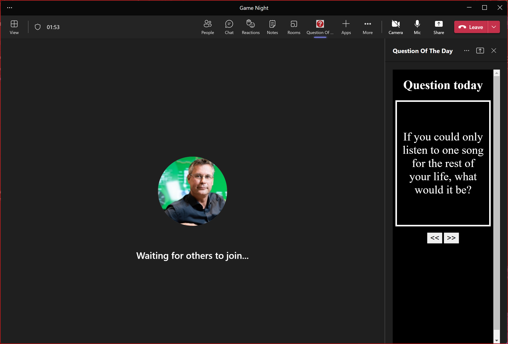

# ❓Questions of the day

This application creates a Teams App where you can have a question of the day inside a meeting that is visible for everyone. This will give a question of the day to kickstart your meeting and to get everyone engaged. Fluid Framework is used to sync the question to all participants, so every participant sees the same question and when a next or previous question is chosen, this will be immediately synced with all participants

This application can be used in Teams and outside of Teams. In Teams the application will use LiveShare where the fluid framework service of Teams will be used. Outside Teams it will use your own Fluid Relay Service.

## 😎 How does it look?

If you add the application to teams it would look like this.



With the button you can go to next question of you do not like it, or go back to previous. You can go back to max 3 questions.

## 👌 Set it up

1. Build the required infrastructure using the deploy.bicep file in the script folder
    1. Create resource group with:

        ``` code
        az group create --name rg-qotd-test --location westeurope
        ```

    1. Create resources. This will deploy Fluid Relay Service, Azure Function App and Static Web App. The key for the FluidRelay is added as configuration key in the configuration of the Azure Function

        ``` code
        az deployment group create --name myQOTDDeployment1 --resource-group rg-qotd-test --template-file deploy.bicep --parameters appName='qotd' resourceLocation='westeurope'
        ```

1. Deploy the Azure Function for the token provider to the created Azure Function App. Go to command line to the folder  and execute following command. Replace FunctionAppName with your FunctionApp name:

    ```code
    func azure functionapp publish <FunctionAppName>
    ```

1. Copy "client/src/questionList example.js" to "client/src/questionList.js" and add your own questions
1. Copy "client/src/app.config.template.js" to "client/src/app.config.js" and add your own configuration from your own FluidRelay service in Azure. Use the azure functions url for tokenProvierUrl
1. Build the client and deploy to a Azure Static Web Site. You should be able to test the app now in the browser

To test in Teams:

1. Change the configurationUrl in the client/manifest/manifest.json to the Azure Static Web Site
1. Create a zip for the manifest to be able to deploy in Teams
1. Deploy the manifest to Teams and add the Teams App to a meeting
